# Graph_Extractor
Descargar la aplicación: https://github.com/germancruzram/Graph_Extractor/releases/download/GRAPH_EXTRACTOR_1.10/Graph.Extractor.1.10.zip

## 🎯 Descripción del Proyecto

Como ingenieros viales, frecuentemente necesitamos extraer datos cuantitativos de gráficas publicadas en:
- 📋 Documentos técnicos especializados
- 📖 Manuales de diseño de pavimentos
- 📊 Reportes de investigación
- 🔬 Papers científicos

**Graph_Extractor** es una solución desarrollada en Python que automatiza este proceso crítico, proporcionando precisión y eficiencia en la digitalización de datos gráficos.

## 🖥️ Interfaz de Usuario

## ✨ Características Principales

| Característica | Descripción | Beneficio |
|----------------|-------------|-----------|
| 🎯 **Calibración de Alta Precisión** | Corrección automática de distorsiones perspectivas | Datos exactos y confiables |
| 📈 **Escalas Logarítmicas** | Soporte completo para análisis de fatiga y módulos dinámicos | Esencial para ingeniería de pavimentos |
| 🔄 **Interpolación Cúbica Spline** | Generación de curvas suaves de alta densidad | Análisis detallado y preciso |
| 💾 **Exportación CSV** | Salida directa para análisis posterior | Integración con herramientas existentes |
| 🖥️ **Interfaz Intuitiva** | Diseñada específicamente para ingenieros | Curva de aprendizaje mínima |

## 🔧 Proceso Metodológico

```mermaid
graph LR
  A[📁 Carga de Imagen] --> B[🎯 Calibración]
  B --> C[✏️ Trazado de Puntos]
  C --> D[📊 Interpolación]
  D --> E[💾 Exportación CSV]
  
  style A fill:#e1f5fe
  style B fill:#f3e5f5
  style C fill:#e8f5e8
  style D fill:#fff3e0
  style E fill:#fce4ec
```

### Paso 1: 📁 Carga de Imagen
- **Formatos soportados**: PNG, JPG, BMP, TIFF
- **Resolución**: Optimizado para imágenes de alta calidad
- **Preprocesamiento**: Mejora automática de contraste y nitidez

### Paso 2: 🎯 Calibración
- **Definición de ejes**: Establecimiento preciso del dominio y rango
- **Corrección perspectiva**: Eliminación de distorsiones geométricas
- **Validación**: Sistema de verificación de precisión

### Paso 3: ✏️ Trazado de Puntos
- **Captura manual**: Control total sobre la selección de puntos
- **Asistencia visual**: Zoom y herramientas de precisión
- **Múltiples curvas**: Soporte para gráficas con varias series de datos

### Paso 4: 📊 Interpolación
- **Spline cúbico**: Generación de curvas suaves
- **Densidad configurable**: Control sobre la cantidad de puntos generados
- **Preservación de tendencias**: Mantenimiento de características originales

### Paso 5: 💾 Exportación
- **Formato CSV**: Compatible con Excel, MATLAB, R, Python
- **Metadatos incluidos**: Información de calibración y configuración
- **Múltiples formatos**: JSON, XML disponibles

## 👨‍💼 Autor

**[GERMAN AHMED CRUZ RAMIREZ]** - *Ingeniero Civil especializado en Gestión de Pavimentos*

- 📧 Email: germancruzram@gmail.com
- 💼 LinkedIn: ([https://linkedin.com/in/tu-perfil](https://www.linkedin.com/in/german-cruz-ram-in24/)
- 🐙 GitHub: ([https://github.com/tu-usuario](https://github.com/germancruzram)

Dedicado a la memoria de Denis Ramírez Aviles (2025)
